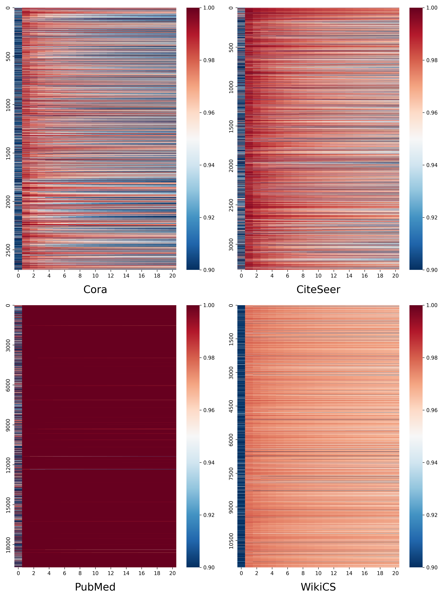

+++ 
draft = false
date = 2026-02-03T21:21:58+08:00
title = "[毕业设计]Day3"
description = ""
slug = "dissertation-day3"
authors = []
tags = []
categories = []
externalLink = ""
series = []
+++

## 完成 $\text{sampling bias}$ 验证 

在 $Cora$ ，$PubMed$ ，$CiteSeer$ ，$WikiCS$ 四个数据集上验证采样偏差并绘制图像

## 定义 $\text{GCL}$ 为 $\text{P-U learning}$ 问题

由 $\text{sampling bias validation}$ 实验结果可知，传统 $\text{GCL}$ 存在以下问题：

正样本集 $D^+$ 只包含由同一原始结点增强而来的节点对 $\{(u_i,v_i),(v_i,u_i)\}^N_{i = 1}$ ，也就是 $D^{aug+}$ ，负样本集 $D^-$ 包含所有不在正样本集 $D^+$ 中的节点对 $\{(u_i,v_j),(v_j,u_i)\}^{N}_{i \neq j,i,j = 1}$  ，也就是 $D^{aug-}$ ，即
$$
D^+ = D^{aug+} = \{(u_i,v_i),(v_i,u_i)\}^N_{i = 1} \\
D^- = D^{aug-} = \{(u_i,v_j),(v_j,u_i)\}^{N}_{i \neq j,i,j = 1}
$$
注意，图对比学习中的正样本集 $D^+$ 应为增强视图中所有语义相近的结点对，负样本集 $D^-$ 应为所有语义差异大的结点对，而经过采样偏差验证实验，我们发现在 $D^-$ 中出现了大量语义相近的结点对，正是这些被错误划分的结点对限制了 $\text{GCL}$ 的效果

为此，我们需要在传统 $\text{GCL}$ 的基础上重新划分正负样本集，采样偏差。正样本集 $D^+$ 包含所有实际语义相近的结点对，而 $D^{aug+}$ 中的结点对都是经过同一原始结点增强得到的，理所当然地拥有相近的语义，因此 $D^{aug+}$ 自然是 $D^+$ 的一个组成部分。除此之外，我们还需要挖掘出 $D^{aug-}$ 中拥有相近语义的结点对，将其加入到 $D^+$ ，因此
$$
D^+ = D^{aug+} + D^{aug-}中语义相近的结点对
$$
而 $D^-$ 自然为
$$
D^- = D^{aug-} - D^{aug-}中语义相近的结点对
$$
由以上分析可知，语义引导的图对比学习首先要实现从 $D^{aug-}$ 中找到语义接近的结点对，将其重新划分到 $D^+$ 中，而 $D^{aug+}$ 中的结点全部拥有相近的语义，我们可以认为：

- $D^{aug+}$ 中的结点对已经被正确标记，拥有相近语义
- $D^{aug-}$ 中的结点对还没有被标记，需要找出语义相近的结点对

为了使表示简洁，我们定义两个变量：语义变量 $y = \{-1,+1\}$ ，其中 $y(x) = +1 \quad (x为结点对)$ 表示结点对 $x$ 具有相近的语义，应被划分到正样本集 $D^+$ (注意这是一个上帝视角的变量，在无监督学习的过程中是未知的)；标签状态 $o = \{-1,+1\}$ ，$o(x) = +1$ 表示结点对 $x$ 已经被打上标签

如果用 $D_L$ 表示所有已经被标记的结点对的集合，那么有 $D_L = D^{aug+}$ ， $D_L^+$  表示 $D_L$ 中实际语义相近的结点对的集合， $D_L^-$ 中实际语义差异大的结点对的集合，则有
$$
D_L^+ = \{x|y=1,o=1\} = D^{aug+} \\
D_L^- = \{x|y=-1,o=1\} = \varnothing
$$
如果用 $D_U$ 表示所有没有被标记的结点对的集合，那么有 $D_U = D^{aug-}$ ，$D_U^+$  表示 $D_U$ 中实际语义相近的结点对的集合， $D_U^-$ 中实际语义差异大的结点对的集合，则有
$$
D_U^+ = \{x|y=1,o=-1\} \subseteq D^{aug-} \\
D_U^- = \{x|y=-1,o=-1\} \subseteq D^{aug-} \\
D_U^+ \cup D_U^- = D^{aug-}
$$
那么语义引导的图对比学习的正负样本集为
$$
D^+ = D_L^+ + D_U^+ \\
D^- = D_U^- = D_U - D_U^+
$$
至此，问题聚焦于：如何从 $D^{aug-}$ 找出实际语义相近的结点对并将其加入到 $D^+$ ?

## 保序假设 ($\text{IOD}$) 

$\text{Kato et al.}$ 提出了一个宽松而通用的保序假设 ($\text{Invariance of Order,IOD}$) 假设
$$
p(y=+1|x) \le p(y=+1|\hat{x}) \iff p(o=+1|x) \le p(o=+1|\hat{x})
$$
即对于两个样本 $x$ , $\hat{x}$ ，如果 $\hat{x}$ 为正样本的概率更高，那么 $\hat{x}$ 被划分到 $D^{aug+}$ 的概率也更高，反之，如果 $\hat{x}$ 被划分到 $D^{aug+}$ 的概率更高，那么 $\hat{x}$ 为正样本的概率也更高

> 注意，这里的样本 $x$ ，$\hat{x}$ 均为样本对，“正样本”即实际语义近似

在以上假设下， $\text{Kato et al.}$ 提出以下推论
$$
p(y=+1|x) \le p(y=+1|\hat{x}) \iff r(x) \le r(\hat{x}) \\
其中，r(x) := \frac{p(x|y=+1, o=+1)}{p(x)}
$$
 $r(x)$ 为**分布密度比** ($\text{distribution density ratio}$) ，分子 $p(x|y=+1, o=+1)$ 是已知正样本（增强样本 $D^{aug+}$ ）的分布， $p(x)$ 是所有样本的分布。 $r(x)$ 反映了样本 $x$ 与 $D^{aug+}$ 中正样本的相似性， $r(x)$ 越大，说明样本 $x$ 与 $D^{aug+}$ 中的正样本越像，根据推论，该样本是正样本的概率也就越大

基于此推论，我们可以设计一个分类器 $h()$ ，它借助分布密度比 $r(x)$ 和 阈值 $t_r$ 实现在未标记样本 $D^{aug-}$ 中寻找正样本
$$
y(x) = h(x) := \text{sign}(r(x) - t_r)
$$
即对于 $D_U = D^{aug-}$ 中的任意一个样本 $x$ ，如果 $r(x) > t_r$ ，说明它是隐藏的正样本，应划分到 $D^+$   

至此，问题聚焦于：如何获取一个准确的 $r(x)$ ?

## 证明免费午餐 ($\text{Free-Lunch Provided by InfoNCE}$) 

**目标**：证明 $\text{InfoNCE}$ 损失函数
$$
\begin{aligned}
L &= \frac{1}{2N} \sum_{i=1}^N (l_{u_i, v_i} + l_{v_i, u_i}) \\
\text{其中}，l_{u_i, v_i} &= -\log \frac{s_{\theta}(u_i, v_i)}{\sum_{j \neq i, j=1}^N s_{\theta}(u_i, u_j) + \sum_{j=1}^N s_{\theta}(u_i, v_j)} \\ \\
s_{\theta}(u_i, v_j) &= \exp(\text{cos}(\mathbf{U}_i, \mathbf{V}_j) / \tau) 
\end{aligned}
$$
中， $s_\theta(n,n^{\prime}) \propto r(x)$  

**证明**：

在论文 $\text{CPC, Oord et al. 2018}$ 中 $\text{InfoNCE}$ 被初次设计为建模以下密度比（处理序列数据）：
$$
f_k(x_{t+k}, c_t) \propto \frac{p(x_{t+k}|c_t)}{p(x_{t+k})}
$$
$c_t$ 表示“当前的上下文”， $x_{t+k}$ 表示“未来的某个样本”，即 $\text{InfoNCE}$ 训练出的打分函数 $f_k$ ，其数值正比于 $x_{t+k}$ “**在这个上下文下出现的概率**（分子）”除以“**随机出现的概率**（分母）”

在 $\text{GCL}$ 中，没有“过去”“未来”等概念，只有两个互为增强视图的结点 $n$ 和 $n^{\prime}$ （或者表述为 $u_i$ 和 $v_i$），因此对上述公式中的变量做以下映射：

- **上下文 $c_t$** $\rightarrow$ **锚点节点 $n'$** ($\text{Anchor Node}$)
- **未来样本 $x_{t+k}$** $\rightarrow$ **正样本节点 $n$** ($\text{Positive Node}$)
- **打分函数 $f_k$** $\rightarrow$ **相似度函数 $s_\theta(n, n')$**
- **概率分布 $p$** $\rightarrow$ **图上结点的概率密度 $q$** 

从而得到
$$
s_{\theta}(n, n') \propto \frac{q(n|n')}{q(n)}
$$

> 为什么这样的映射是合理的？

又根据条件概率公式
$$
P(A|B) = \frac{P(A, B)}{P(B)}
$$
将分子展开，得到
$$
s_{\theta}(n,n^{\prime})\propto\frac{q(n|n^{\prime})}{q(n)}=\frac{q(n,n^{\prime})/q(n^{\prime})}{q(n)}=\frac{q(n,n^{\prime})}{q(n)q(n^{\prime})}
$$
又因为
$$
p(x=(n,n^{\prime})|y=+1,o=+1)=q(n,n^{\prime}) \\
p(x=(n,n^{\prime}))=q(n)q(n^{\prime})
$$

> 这两个等式为什么成立？

从而得到
$$
s_{\theta}(n, n') \propto \frac{q(n, n')}{q(n)q(n')} = \frac{p(x|y = +1, o = +1)}{p(x)} = r(x)
$$
接下来，公式
$$
p(y=+1|x) \le p(y=+1|\hat{x}) \iff r(x) \le r(\hat{x})
$$
就可以继续推导成
$$
\begin{aligned}
&\forall \mathbf{x} = (n, n'), \mathbf{\hat{x}} = (\hat{n}, \hat{n}') \in D : \\
&p(y = +1|\mathbf{x}) \leq p(y = +1|\mathbf{\hat{x}}) \Leftrightarrow s_{\theta}(n, n') \leq s_{\theta}(\hat{n}, \hat{n}')
\end{aligned}
$$
之前的分类器
$$
y(x) = h(x) := \text{sign}(r(x) - t_r)
$$
也可以进一步改为
$$
y(\mathbf{x}) = h_s(\mathbf{x} = (n, n'); \theta) := \text{sign}(s_{\theta}(n, n') - t_s)
$$
至此，我们找到了从未标记样本 $D_U = D^{aug-}$ 中找出正样本来消除采样偏差的方法
$$
\begin{aligned}
D_U^+ &= \{(n, n')\}^{(n, n') \in D_U} _ {\text{sign}(s_{\theta}(n, n') - t_s) = +1} \\
D^+ &= D_L^+ \cup D_U^+ \\
D^- &= D_U - D_U^+
\end{aligned}
$$

