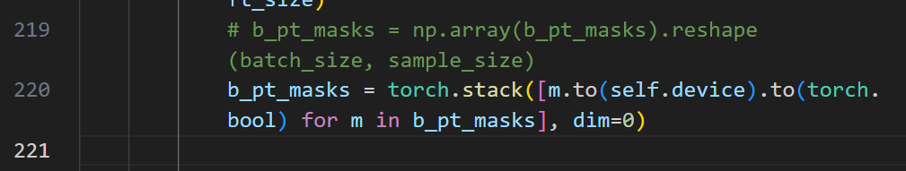
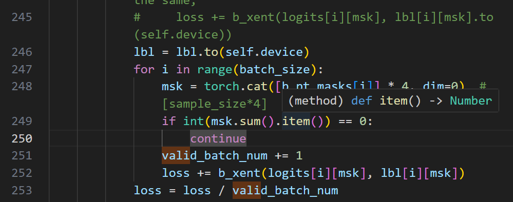

+++ 
draft = false
date = 2026-02-07T22:25:00+08:00
title = "[毕业设计]Day7"
description = ""
slug = "dissertation-day7"
authors = []
tags = []
categories = []
externalLink = ""
series = []
+++

## 数据加载模块 $\text{dataset.py}$

```python
import torch
from torch_geometric.datasets import Planetoid
import torch_geometric.transforms as T

def get_dataset(root, name):
    """
    对应开源代码 main.py 中的 get_dataset 函数
    功能：加载标准图数据集
    """
    dataset = Planetoid(root=root, name=name, transform=T.NormalizeFeatures())
    data = dataset[0]
    return data, dataset.num_features, dataset.num_classes

# 测试一下
# data, num_features, num_classes = get_dataset('./datasets', 'Cora')
# print(f"Loaded {data}")
```

## 图增强模块 $\text{augmentation.py}$

```python
import torch
from torch_geometric.utils import dropout_adj

def drop_feature(x, drop_prob):
    """
    对应开源代码 gca_functional.py 中的 drop_feature 函数
    功能：随机掩盖节点特征
    """
    if drop_prob <= 0.:
        return x
    
    # 生成一个跟特征维度一样的 mask (shape: [F])
    drop_mask = torch.empty(
        (x.size(1),),
        dtype=torch.float32,
        device=x.device
    ).uniform_(0, 1) < drop_prob

    x = x.clone()
    x[:, drop_mask] = 0 # 将被 mask 的特征置为 0
    return x

def drop_edge(edge_index, drop_prob):
    """
    对应开源代码 gca_functional.py 中的 drop_edge 函数
    功能：随机删除边
    """
    if drop_prob <= 0.:
        return edge_index
    
    # 使用 PyG 的工具函数随机 drop 边
    edge_index, _ = dropout_adj(
        edge_index,
        p=drop_prob,
        force_undirected=True, # 保持无向图性质
        num_nodes=None,
        training=True
    )
    return edge_index

# GCA 特有的自适应增强 (复现 IFL-GC 时需要)
# 对应 gca_functional.py 中的 adaptive_drop_edge 等逻辑
# 暂时我们可以先只实现统一的 drop，后续复现 IFL-GC 时再扩展
```

## 编码器结构定义

确保各种图对比学习方法训练出来的编码器 $f_\theta$ 结构一致，排除编码器结构对实验结果的影响

```cpp
import torch
import torch.nn as nn
import torch.nn.functional as F
from torch_geometric.nn import GCNConv

def get_activation_func(activation_str):
    """
    对应 model.py L32-33
    简单的激活函数工厂
    """
    if activation_str == 'relu':
        return F.relu
    elif activation_str == 'prelu':
        return nn.PReLU()
    else:
        raise ValueError(f"Activation {activation_str} not supported")

class Encoder(torch.nn.Module):
    """
    对应 model.py L58 class Encoder
    """
    def __init__(self, in_channels, out_channels, activation='relu', base_model='GCNConv', k=2):
        super(Encoder, self).__init__()
        # 在开源代码中，我是通过 args 传参的 (L60-63)
        # 这里为了让你看清楚结构，我把参数展开了
        self.base_model = GCNConv # 默认使用 GCNConv
        self.in_channels = in_channels
        self.out_channels = out_channels
        self.k = k # 层数，默认为 2 (L64)
        
        # 构建 GCN 层 (L66-70)
        # 第一层：输入 -> 2 * hidden
        # 中间层：2 * hidden -> 2 * hidden
        # 最后一层：2 * hidden -> output
        self.conv = [self.base_model(self.in_channels, 2 * self.out_channels)]
        for _ in range(1, self.k-1):
            self.conv.append(self.base_model(2 * self.out_channels, 2 * self.out_channels))
        self.conv.append(self.base_model(2 * self.out_channels, self.out_channels))
        
        # 注册为 ModuleList，否则 PyTorch 无法识别这些层
        self.conv = nn.ModuleList(self.conv)

        self.activation = get_activation_func(activation)

    def forward(self, x: torch.Tensor, edge_index: torch.Tensor):
        """
        对应 model.py L74-77
        """
        for i in range(self.k):
            # 每一层都是：卷积 -> 激活
            # 注意：最后一层通常也加激活，这在 GCL 中很常见
            x = self.activation(self.conv[i](x, edge_index))
        return x
```

## 定义 $\text{class GRACE()}$ 

 $\text{GRACE}$ 类用于实现：

- 图对比学习方法 $\text{GRACE}$
- 将其用于 $\text{warm-up}$ 阶段，在其基础上实现 $\text{IFL-GR}$

```cpp
class GRACE(torch.nn.Module):
    """
    对应 model.py L79 class GRACE
    这是 IFL-GR 的基础骨架。
    """
    def __init__(self, encoder: Encoder, num_hidden, num_proj_hidden, tau=0.5):
        super(GRACE, self).__init__()
        self.encoder: Encoder = encoder
        self.tau: float = tau
        
        # 投影头 (Projection Head)
        # 对应 model.py L85-86
        # 结构：Linear -> ELU -> Linear
        self.fc1 = torch.nn.Linear(num_hidden, num_proj_hidden)
        self.fc2 = torch.nn.Linear(num_proj_hidden, num_hidden)

    def forward(self, x: torch.Tensor, edge_index: torch.Tensor) -> torch.Tensor:
        """
        对应 model.py L90-92
        注意：forward 只负责输出 Encoder 的表示 (Representation)
        这主要用于 Evaluation 阶段提取特征。
        """
        return self.encoder(x, edge_index)

    def projection(self, z: torch.Tensor) -> torch.Tensor:
        """
        对应 model.py L94-96
        把 Encoder 的输出 z 映射为 h，用于计算对比 Loss
        """
        z = F.elu(self.fc1(z))
        return self.fc2(z)

    def sim(self, z1: torch.Tensor, z2: torch.Tensor):
        """
        对应 model.py L98-101
        计算余弦相似度
        """
        z1 = F.normalize(z1)
        z2 = F.normalize(z2)
        return torch.mm(z1, z2.t())
        
    def loss(self, z1: torch.Tensor, z2: torch.Tensor, cur_epoch: int, args):
        """
        计算总 Loss：
        L = (L(view1, view2) + L(view2, view1)) / 2
        对应 model.py L354-365
        """
        # 1. 经过 Projection Head 映射
        h1 = self.projection(z1)
        h2 = self.projection(z2)
        
        # 2. 计算两个方向的 Loss
        # 必须传入 cur_epoch，因为 IFL 需要判断是否预热结束
        l1 = self.semi_loss(h1, h2, cur_epoch, args)
        l2 = self.semi_loss(h2, h1, cur_epoch, args)

        # 3. 取平均
        ret = (l1 + l2) * 0.5
        return ret.mean()

    def semi_loss(self, z1: torch.Tensor, z2: torch.Tensor, cur_epoch: int, args):
        """
        核心函数：计算单个方向的对比损失
        对应 model.py L103-157 (简化版，去除了保存权重的 IO 操作)
        """
        f = lambda x: torch.exp(x / self.tau)
        
        # 1. 计算相似度矩阵 (全部样本 vs 全部样本)
        # refl_sim: 视图 1 内部的相似度 (Intra-view)
        # between_sim: 视图 1 和 视图 2 之间的相似度 (Inter-view)
        refl_sim = f(self.sim(z1, z1))
        between_sim = f(self.sim(z1, z2))
        
        # 2. 计算分母 (Denominator)
        # 对应 InfoNCE 分母：所有负样本 + 正样本
        # 注意：refl_sim 对角线是自己对自己，通常不包含在负样本里，要减掉
        # A = sum(exp(sim(u, v_pos))) + sum(exp(sim(u, v_neg)))
        A = between_sim.sum(1) + refl_sim.sum(1) - refl_sim.diag()
        
        # 3. 计算原始的 Log Probability 矩阵
        # B_loss_matrix[i, j] = -log( exp(sim(i, j)) / A[i] )
        B_loss_matrix = -torch.log(between_sim / A.unsqueeze(-1))
        
        # 同理计算 R_loss_matrix (视图内部)
        R_loss_matrix = -torch.log(refl_sim / A.unsqueeze(-1))
        # 排除对角线 (自己不能做自己的负样本)
        R_loss_matrix.fill_diagonal_(0)

        # --- 核心逻辑分支 ---
        
        # 分支 A: IFL-GR (开启 Theory View 且 预热结束)
        if args.theroy_view and cur_epoch >= args.start_debias_epoch:
            # 这里的逻辑对应论文公式 (20) 和 (26)
            # 我们需要找到 D_U+ (潜在正样本) 并给它们加权
            
            # --- 4.1 计算权重 (Weights) ---
            # 简化逻辑：直接用当前的相似度作为权重的依据
            # 归一化相似度到 [0, 1]
            R_sim_raw = f(self.sim(z1, z1)).detach()
            R_W = (R_sim_raw - R_sim_raw.min()) / (R_sim_raw.max() - R_sim_raw.min() + 1e-8)
            
            B_sim_raw = f(self.sim(z1, z2)).detach()
            B_W = (B_sim_raw - B_sim_raw.min()) / (B_sim_raw.max() - B_sim_raw.min() + 1e-8)
            
            # --- 4.2 筛选 D_U+ (Masking) ---
            # 只有相似度超过阈值 (t_s) 的才算
            # 对应 args.R_W_threshold 和 args.B_W_threshold
            R_W[R_W < args.R_W_threshold] = 0
            B_W[B_W < args.B_W_threshold] = 0
            
            # 还要把 R_W 的对角线清零
            R_W.fill_diagonal_(0)
            
            # --- 4.3 修正原有正样本 ---
            # 原来的正样本 (对角线) 权重必须是 1
            if args.stay_diag_eye:
                B_W.fill_diagonal_(1)

            # --- 4.4 计算加权 Loss ---
            # 对应公式 (27): sum( -log(P) * Weight )
            # 只计算权重 > 0 的部分
            R_info_nce = torch.masked_select(R_loss_matrix * R_W, R_W > 0)
            B_info_nce = torch.masked_select(B_loss_matrix * B_W, B_W > 0)
            
            # 合并两个视图的 Loss
            info_nce = torch.cat((R_info_nce, B_info_nce)).mean()
            
        # 分支 B: Baseline (GRACE) 或 预热阶段
        else:
            # 传统的 InfoNCE 只看对角线 (Augmentation Pairs)
            # 也就是只选 B_loss_matrix 的对角线元素
            pos_mask = torch.eye(z1.shape[0], device=z1.device).bool()
            info_nce = torch.masked_select(B_loss_matrix, pos_mask).mean()

        return info_nce
```

`if args.theroy_view and cur_epoch >= args.start_debias_epoch: ... else ...` 实现了普通 $\text{GRACE}$ 与 $\text{INF-GR}$ 的切换

## 运行开源代码进行实验

由于上面的代码运行结果不佳，故而先运行论文开源代码进行实验

###  $\text{Cora}$ 数据集

####  $\text{GRACE}$

命令：

```bash
& D:/SoftWare/anaconda/envs/GCL/python.exe main.py --model GRACE --dataset Cora --senario ID --gpu_id 0 --seed 39788
```

结果：

```html
Seed: 39788
Dataset: Cora
Model: GRACE
Num_epochs: 500
Repeat_times: 3
tau: 0.4
drop_edge_rate_1: 0.2
drop_edge_rate_2: 0.4
drop_feature_rate_1: 0.3
drop_feature_rate_2: 0.4
best val acc: 85.0861% ± 0.980159%
correspoding test acc: 83.8257% ± 0.964841%

Seed: 666
Dataset: Cora
Model: GRACE
Num_epochs: 500
Repeat_times: 3
tau: 0.4
drop_edge_rate_1: 0.2
drop_edge_rate_2: 0.4
drop_feature_rate_1: 0.3
drop_feature_rate_2: 0.4
best val acc: 85.5474% ± 1.167702%
correspoding test acc: 83.8503% ± 0.693698%
```

####  $\text{IFL-GR}$

先创建 `./Theroy_View_Weights/` 和 `./Upos/` 文件夹

命令：

```bash
& D:/SoftWare/anaconda/envs/GCL/python.exe main.py --model GRACE --dataset Cora --senario ID --gpu_id 0 --seed 39788 --theroy_view --start_debias_epoch 200 --update_interval 1 --B_W_threshold 0.6 --R_W_threshold 0.6 --norm_sim_matrix global --stay_diag_eye 1
```

结果：

```html
Seed: 39788
Dataset: Cora
Model: GRACE
Num_epochs: 500
Repeat_times: 3
tau: 0.4
drop_edge_rate_1: 0.2
drop_edge_rate_2: 0.4
drop_feature_rate_1: 0.3
drop_feature_rate_2: 0.4
start_debias_epoch: 200
update_interval: 1
R_W_threshold: 0.6
B_W_threshold: 0.6
best val acc: 85.3321% ± 0.855500%
correspoding test acc: 83.8503% ± 0.736909%

Seed: 666
Dataset: Cora
Model: GRACE
Num_epochs: 500
Repeat_times: 3
tau: 0.4
drop_edge_rate_1: 0.2
drop_edge_rate_2: 0.4
drop_feature_rate_1: 0.3
drop_feature_rate_2: 0.4
start_debias_epoch: 200
update_interval: 1
R_W_threshold: 0.6
B_W_threshold: 0.6
best val acc: 85.2399% ± 0.225968%
correspoding test acc: 84.3181% ± 0.271919%
```

####  $\text{GCA}$

在 `gca_functional.py` 末尾追加了：

```python
from typing import Optional
import torch
from torch_geometric.utils import to_undirected, degree

_EPS = 1e-12

def _minmax_norm(x: torch.Tensor) -> torch.Tensor:
    x = x.float()
    return (x - x.min()) / (x.max() - x.min() + _EPS)

@torch.no_grad()
def compute_pr(edge_index: torch.Tensor, *, num_nodes: Optional[int] = None, damp: float = 0.85, k: int = 200):
    if num_nodes is None:
        num_nodes = int(edge_index.max()) + 1
    edge_index = to_undirected(edge_index, num_nodes=num_nodes)
    src, dst = edge_index[0], edge_index[1]
    deg_src = degree(src, num_nodes=num_nodes).clamp(min=1)

    pr = torch.full((num_nodes,), 1.0 / num_nodes, device=edge_index.device, dtype=torch.float32)
    base = (1.0 - damp) / num_nodes
    for _ in range(k):
        msg = pr[src] / deg_src[src]
        pr_new = torch.zeros_like(pr).index_add_(0, dst, msg)
        pr = base + damp * pr_new
    return pr

@torch.no_grad()
def eigenvector_centrality(data, *, max_iter: int = 100, tol: float = 1e-6):
    edge_index = to_undirected(data.edge_index)
    num_nodes = int(edge_index.max()) + 1
    src, dst = edge_index[0], edge_index[1]

    v = torch.ones((num_nodes,), device=edge_index.device, dtype=torch.float32)
    v = v / (v.norm(p=2) + _EPS)

    for _ in range(max_iter):
        v_new = torch.zeros_like(v).index_add_(0, dst, v[src])
        v_new = v_new / (v_new.norm(p=2) + _EPS)
        if (v_new - v).abs().max().item() < tol:
            v = v_new
            break
        v = v_new
    return v

@torch.no_grad()
def feature_drop_weights(x: torch.Tensor, *, node_c: torch.Tensor):
    x = x.float()
    node_c = node_c.float()
    node_c = node_c / (node_c.mean() + _EPS)
    w = (x.abs().t() @ node_c) / (node_c.sum() + _EPS)  # [F]
    return _minmax_norm(w) + _EPS

@torch.no_grad()
def degree_drop_weights(edge_index: torch.Tensor):
    num_nodes = int(edge_index.max()) + 1
    edge_index = to_undirected(edge_index, num_nodes=num_nodes)
    src, dst = edge_index[0], edge_index[1]
    deg = degree(src, num_nodes=num_nodes).clamp(min=0)
    w = deg[src] + deg[dst]
    return _minmax_norm(w) + _EPS

@torch.no_grad()
def pr_drop_weights(edge_index: torch.Tensor, *, aggr: str = "sink", k: int = 200):
    num_nodes = int(edge_index.max()) + 1
    pr = compute_pr(edge_index, num_nodes=num_nodes, k=k)
    edge_index = to_undirected(edge_index, num_nodes=num_nodes)
    src, dst = edge_index[0], edge_index[1]
    w = pr[dst] if aggr == "sink" else pr[src]
    return _minmax_norm(w) + _EPS

@torch.no_grad()
def evc_drop_weights(data):
    evc = eigenvector_centrality(data)
    edge_index = to_undirected(data.edge_index)
    src, dst = edge_index[0], edge_index[1]
    w = evc[src] + evc[dst]
    return _minmax_norm(w) + _EPS

def drop_edge_weighted(edge_index: torch.Tensor, edge_weight: torch.Tensor, *, p: float, threshold: float = 0.7):
    if p <= 0 or edge_weight is None:
        return edge_index
    edge_weight = edge_weight.float()
    prob = p * (edge_weight / (edge_weight.mean() + _EPS))
    prob = prob.clamp(min=0.0, max=float(threshold))
    keep = torch.rand(prob.size(0), device=prob.device) >= prob
    return edge_index[:, keep]

def drop_feature_weighted_2(x: torch.Tensor, feature_weight: torch.Tensor, p: float):
    if p <= 0 or feature_weight is None:
        return x
    feature_weight = feature_weight.float()
    prob = p * (feature_weight / (feature_weight.mean() + _EPS))
    prob = prob.clamp(min=0.0, max=1.0)
    drop_mask = torch.rand(prob.size(0), device=prob.device) < prob
    x = x.clone()
    x[:, drop_mask] = 0
    return x
```

 命令

```bash
& D:/SoftWare/anaconda/envs/GCL/python.exe main.py --model GCA --dataset Cora --senario ID --gpu_id 0 --seed 39788
```

结果

```html
Seed: 39788
Dataset: Cora
Model: GCA
Num_epochs: 500
Repeat_times: 3
tau: 0.4
drop_edge_rate_1: 0.2
drop_edge_rate_2: 0.4
drop_feature_rate_1: 0.3
drop_feature_rate_2: 0.4
drop_scheme: degree
best val acc: 77.7368% ± 0.761963%
correspoding test acc: 75.7509% ± 1.239263%

Seed: 666
Dataset: Cora
Model: GCA
Num_epochs: 500
Repeat_times: 3
tau: 0.4
drop_edge_rate_1: 0.2
drop_edge_rate_2: 0.4
drop_feature_rate_1: 0.3
drop_feature_rate_2: 0.4
drop_scheme: degree
best val acc: 78.9053% ± 1.055412%
correspoding test acc: 76.0217% ± 1.002426%
```

####  $\text{IFL-GC}$

命令

```bash
& D:/SoftWare/anaconda/envs/GCL/python.exe main.py --model GCA --dataset Cora --senario ID --gpu_id 0 --seed 39788 --drop_scheme degree --theroy_view --start_debias_epoch 100 --update_interval 20 --B_W_threshold 0.6 --R_W_threshold 0.6 --norm_sim_matrix global --stay_diag_eye 1
```

结果

```html
Seed: 39788
Dataset: Cora
Model: GCA
Num_epochs: 500
Repeat_times: 3
tau: 0.4
drop_edge_rate_1: 0.2
drop_edge_rate_2: 0.4
drop_feature_rate_1: 0.3
drop_feature_rate_2: 0.4
drop_scheme: degree
start_debias_epoch: 100
update_interval: 20
R_W_threshold: 0.6
B_W_threshold: 0.6
best val acc: 78.4748% ± 0.285167%
correspoding test acc: 79.3205% ± 0.844236%

Seed: 666
Dataset: Cora
Model: GCA
Num_epochs: 500
Repeat_times: 3
tau: 0.4
drop_edge_rate_1: 0.2
drop_edge_rate_2: 0.4
drop_feature_rate_1: 0.3
drop_feature_rate_2: 0.4
drop_scheme: degree
start_debias_epoch: 100
update_interval: 20
R_W_threshold: 0.6
B_W_threshold: 0.6
best val acc: 79.4280% ± 2.026723%
correspoding test acc: 79.3698% ± 1.072527%
```

####  $\text{DGI}$

在 `main.py` 开头添加：

```python
from typing import Optional
```

命令

```bash
& D:/SoftWare/anaconda/envs/GCL/python.exe main.py --model DGI --dataset Cora --senario ID --gpu_id 0 --seed 39788 --gradient_drop_threshold 1e-4
```

结果

```html
Seed: 39788
Dataset: Cora
Model: DGI
Num_epochs: 500
Repeat_times: 3
best val acc: 85.0554% ± 0.328323%
correspoding test acc: 82.4225% ± 0.941956%

Seed: 666
Dataset: Cora
Model: DGI
Num_epochs: 500
Repeat_times: 3
best val acc: 85.0246% ± 1.348113%
correspoding test acc: 84.2688% ± 0.422118%
```

####  $\text{COSTA}$

命令

```bash
& D:/SoftWare/anaconda/envs/GCL/python.exe main.py --model COSTA --dataset Cora --senario ID --gpu_id 0 --seed 39788
```

结果

```html
Seed: 39788
Dataset: Cora
Model: COSTA
Num_epochs: 500
Repeat_times: 3
best val acc: 85.1476% ± 0.260925%
correspoding test acc: 83.9242% ± 0.278526%

Seed: 666
Dataset: Cora
Model: COSTA
Num_epochs: 500
Repeat_times: 3
best val acc: 85.3014% ± 0.156796%
correspoding test acc: 84.6135% ± 0.853517%
```

####  $\text{BGRL}$ 

命令

```bash
& D:/SoftWare/anaconda/envs/GCL/python.exe main.py --model BGRL --dataset Cora --senario ID --gpu_id 0 --seed 39788 --gradient_drop_threshold 1e-4
```

结果

```html
Seed: 39788
Dataset: Cora
Model: BGRL
Num_epochs: 500
Repeat_times: 3
best val acc: 79.1205% ± 0.189558%
correspoding test acc: 77.1787% ± 2.206612%

Seed: 666
Dataset: Cora
Model: BGRL
Num_epochs: 500
Repeat_times: 3
best val acc: 80.8733% ± 0.285167%
correspoding test acc: 78.9513% ± 0.783933%
```


####  $\text{MVGRL}$

修改 `pre_train.py` $\text{line 219}$



修改 `pre_train.py` $\text{line 239-245}$ 



命令

```bash
& D:/SoftWare/anaconda/envs/GCL/python.exe main.py --model MVGRL --dataset Cora --senario ID --gpu_id 0 --seed 39788 --learning_rate 0.001 --gradient_drop_threshold 1e-5 --tolerance_epoch_num 20 --mvgrl_alpha 0.2
```

结果

```html
Seed: 39788
Dataset: Cora
Model: MVGRL
Num_epochs: 500
Repeat_times: 3
best val acc: 84.4711% ± 0.711921%
correspoding test acc: 82.2501% ± 0.775382%

Seed: 666
Dataset: Cora
Model: MVGRL
Num_epochs: 500
Repeat_times: 3
best val acc: 84.6556% ± 0.980159%
correspoding test acc: 82.6686% ± 0.560306%
```

####  $\text{GBT}$

命令

```bash
& D:/SoftWare/anaconda/envs/GCL/python.exe main.py --model GBT --dataset Cora --senario ID --gpu_id 0 --seed 39788 --weight_decay 0 --num_hidden 512 --batch_size 4 --p_x 0.1 --p_e 0.4 --gradient_drop_threshold 1e-3
```

结果

```html
Seed: 39788
Dataset: Cora
Model: GBT
Num_epochs: 500
Repeat_times: 3
best val acc: 84.7171% ± 1.318324%
correspoding test acc: 84.4165% ± 0.928346%

Seed: 666
Dataset: Cora
Model: GBT
Num_epochs: 500
Repeat_times: 3
best val acc: 85.7626% ± 0.627186%
correspoding test acc: 84.1211% ± 0.159546%
```
